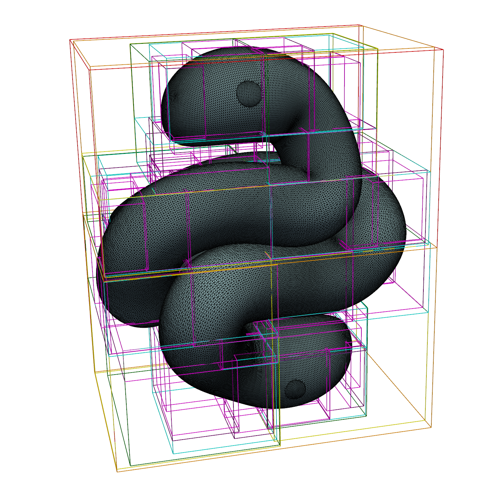

# pytinybvh

[](https://opensource.org/licenses/MIT)

Python bindings for the great C++ Bounding Volume Hierarchy (BVH) library [tinybvh](https://github.com/jbikker/tinybvh) by Jacco Bikker.

Exposes `tinybvh`'s fast BVH construction algorithms to Python.
For example, the BVH can be used as-is in a SSBO for real time ray-tracing with PyOpenGL or Vulkan, or for CPU-side computations like collision detection, etc.

<div style="text-align:center">

</div>

## Current status

Most of `tinybvh`'s core functionality is now implemented and functional :)

See [Features](#Features) and [Roadmap](#Roadmap) below for more details.

## Prerequisites

Before installing, you need a few tools on your system:

1.  **A C++20 Compatible Compiler:**
    *   **Windows:** MSVC (Visual Studio 2019 or newer with the "Desktop development with C++" workload)
    *   **Linux:** GCC 10+ or Clang 11+
    *   **macOS:** Xcode with modern Clang
2.  **Python 3.9+**
3.  **Git:** Required for cloning the repository and its dependencies

## Installation

The C++ dependency (`tinybvh`) is included as a Git submodule.

1.  **Clone the repository:**

    ```bash
    git clone --recurse-submodules https://github.com/FlorentLM/pytinybvh.git
    cd pytinybvh
    ```

2.  **Create and activate a virtual environment:**
    I like `uv`, but `venv` works too.

    ```bash
    # Using uv
    uv venv
    source .venv/bin/activate
    # On Windows: .venv\Scripts\activate
    ```

3.  **Compile and install:**
    This command will automatically download Python dependencies and compile the C++ extension module.

    ```bash
    uv pip install .
    ```

    This installs the core `pytinybvh` library. To include packages for testing and visualisation, you can install "extras":

    ```bash
    # Install everything needed for development (testing, visualisation)
    uv pip install .[dev]
    
    # Or install specific groups
    uv pip install .[test]
    uv pip install .[visualise]
    ```

4. **Use in other projects:**
   From the virtual environment of your other project:

   ```bash
    uv pip install /path/to/pytinybvh
    ```

## Performance & Build optimizations

For users building from source who want maximum performance on their specific machine, `pytinybvh` supports two key optimizations offered by `tinybvh`:

### 1. Parallelization

The batch intersection and occlusion methods (`intersect_batch`, `is_occluded_batch`) take advantage of multiple CPU cores. The build script automatically detects if your compiler supports OpenMP and enables it.

If your compiler does not support OpenMP, `pytinybvh` will compile and run in serial (single-threaded) mode. You will see a message during installation indicating whether parallelization is enabled.

### 2. SIMD Acceleration (AVX2, NEON, etc.)

`tinybvh` includes highly optimized code paths that use SIMD (Single Instruction, Multiple Data) instructions for significant speedups in BVH traversal. The build script automatically detects the best available instruction set at **compile time**.

On **x86-64**, it checks for and enables the highest supported level:
- 1. **AVX2** (with FMA)
- 2. **SSE4.2**
- 3. Baseline scalar code (if neither is supported)

On **ARM** (aarch64/armv7), it checks for and enables **NEON**.

**IMPORTANT:** SIMD detection happens at **build time**. A binary wheel built with AVX2 will not run on a machine that does not support AVX2. `pytinybvh` includes a runtime check that will raise an error on startup if it detects such an incompatibility.

To force a baseline build without any SIMD optimizations, set the `PYTINYBVH_NO_SIMD` environment variable before installing:

```bash
PYTINYBVH_NO_SIMD=1 uv pip install .
```

## Usage examples

Below are some examples. But be sure to check out the stub file `src/_pytinybvh.pyi` to see everything.

`pytinybvh` provides two types of BVH builders: **Core (zero-copy)** builders for performance and **Convenience (include copying)** builders for ease of use with common data formats.

---

### Core builders (Zero-copy)

These methods are the most performant as they directly use the memory buffer of the passed numpy arrays without creating copies.
**You must ensure the source numpy arrays are not garbage-collected while the BVH is in use.**

#### `BVH.from_vertices(vertices, quality)`
Builds a BVH from a flat "triangle soup" array in `tinybvh`'s native format.

```python
import numpy as np
from pytinybvh import BVH, BuildQuality

# Each triangle is 3 consecutive vertices. Each vertex is (x, y, z, w).
# The 4th component (w) is only for alignment and is ignored.
vertices_4d = np.array([
    # Triangle 0
    [0, 0, 0, 0], [1, 0, 0, 0], [0, 1, 0, 0],
    # Triangle 1
    [2, 2, 2, 0], [3, 2, 2, 0], [2, 3, 2, 0],
], dtype=np.float32)

# This is a zero-copy operation
bvh = BVH.from_vertices(vertices_4d, quality=BuildQuality.Balanced)
```

#### `BVH.from_indexed_mesh(vertices, indices, quality)`
The most memory-efficient method for triangle meshes. It also supports fast refitting if the vertex positions change.

```python
import numpy as np
from pytinybvh import BVH, BuildQuality

# 4 unique vertices
vertices_4d = np.array([
    [0, 0, 0, 0], # 0
    [1, 0, 0, 0], # 1
    [1, 1, 0, 0], # 2
    [0, 1, 0, 0], # 3
], dtype=np.float32)

# 2 triangles referencing the vertices
indices_u32 = np.array([
    [0, 1, 3],
    [1, 2, 3],
], dtype=np.uint32)

# This is a zero-copy operation.
bvh = BVH.from_indexed_mesh(vertices_4d, indices_u32)

# If you modify the vertices_4d array in-place...
vertices_4d[:, 2] += 5.0 # Move the mesh up by 5 units

# ...you can refit the BVH much faster than rebuilding.
bvh.refit()
```

#### `BVH.from_aabbs(aabbs, quality)`
Builds a BVH from a list of pre-defined Axis-Aligned Bounding Boxes. Useful for custom geometry or for building a Top-Level Acceleration Structure (TLAS).

```python
import numpy as np
from pytinybvh import BVH, BuildQuality

# 2 AABBs defined by their min and max corners
aabbs_np = np.array([
    # AABB 0: [[min_x, min_y, min_z], [max_x, max_y, max_z]]
    [[-1, -1, -1], [1, 1, 1]],
    # AABB 1
    [[5, 5, 5], [6, 6, 6]],
], dtype=np.float32)

# This is a zero-copy operation.
bvh = BVH.from_aabbs(aabbs_np)
```
**Note:** When using a BVH built from AABBs, intersection tests are performed directly against the boxes. The hit record's `u` and `v` coordinates will contain the 2D position of the hit on the intersected face of the box.

---

### Convenience builders (with copying)

These methods accept more common numpy array layouts. They internally perform a one-time copy and reformatting of the data.

#### `BVH.from_triangles(triangles, quality)`
The easiest way to build a BVH from a list of triangles.

```python
import numpy as np
from pytinybvh import BVH

# An array of shape (N, 3, 3) or (N, 9)
triangles_np = np.array([
    [[0, 0, 0], [1, 0, 0], [0, 1, 0]],
    [[2, 2, 2], [3, 2, 2], [2, 3, 2]],
], dtype=np.float32)

# This copies the data into the required format.
bvh = BVH.from_triangles(triangles_np)
```

#### `BVH.from_points(points, radius, quality)`
Builds a BVH from a point cloud.

It works by first creating an axis-aligned bounding box for each point to build the hierarchy, then uses ray-sphere tests inside the leaf nodes.

```python
import numpy as np
from pytinybvh import BVH

points_np = np.random.rand(1000, 3).astype(np.float32)

# This creates AABBs for the build, but uses ray-sphere tests at query time.
bvh = BVH.from_points(points_np, radius=0.01)

```
**Note:** For sphere primitives, the hit record's `u` and `v` coordinates represent the spherical texture coordinates of the intersection point.

---

### Ray Intersection

Once a BVH is built, you can perform fast intersection and occlusion queries.

#### Single Ray

```python
from pytinybvh import Ray

# Create a ray
ray = Ray(origin=[0.5, 0.2, -5.0], direction=[0, 0, 1])

# Intersect modifies the ray object in-place. Useful for multiple bounces.
bvh.intersect(ray)

if ray.prim_id != -1: 
    print(f"Hit primitive {ray.prim_id} at distance t={ray.t:.3f}")
    print(f"Barycentric coords: u={ray.u:.3f}, v={ray.v:.3f}")
```

#### Batch of Rays

For high performance, tracing rays in a batch is recommended. `pytinybvh` provides fine-grained control over how batches are traversed.

```python
import numpy as np
from pytinybvh import BVH, BuildQuality, PacketMode

# (N, 3) arrays for origins and directions
origins = np.array([[0.5, 0.2, -5], [10, 10, -5]], dtype=np.float32)
directions = np.array([[0, 0, 1], [0, 0, 1]], dtype=np.float32)

# Returns a structured numpy array with hit records
#
# PacketMode.Never: Always use scalar traversal. Safest and always correct.
hits = bvh.intersect_batch(origins, directions, packet=PacketMode.Never)
#
# PacketMode.Auto (default): Use 256-ray packet traversal only when safe and beneficial
# (e.g. for standard triangle BVHs where rays in a chunk share the same origin).
#
# PacketMode.Force: Force packet traversal. Can be faster but is unsafe if rays are not
# coherent (e.g. different origins, wide spread of directions).

# You can access columns like a dictionary
hit_distances = hits['t']
primitive_ids = hits['prim_id'].astype(np.int32) # Cast to signed int to see -1 for misses

print("Batch Hit Results:")
for i in range(len(hits)):
    if primitive_ids[i] != -1:
        print(f"  Ray {i} hit primitive {primitive_ids[i]} at t={hits[i]['t']:.3f}")
    else:
        print(f"  Ray {i} missed.")

# prints:
# Batch Hit Results:
#   Ray 0 hit primitive 0 at t=5.000
#   Ray 1 missed.

```

#### Batched Occlusion (shadows)

```python
import numpy as np
from pytinybvh import BVH, PacketMode

# (N, 3) arrays for origins and directions
origins = np.array([[0.5, 0.2, -5], [10, 10, -5]], dtype=np.float32)
directions = np.array([[0, 0, 1], [0, 0, 1]], dtype=np.float32)

# Returns a boolean array (N,) where True means "occluded"
# For standard triangle BVHs (BLAS, not TLAS), pytinybvh can use the 256-ray
# intersection packet kernel internally and reduce to occlusion flags (although this might change in the future)
occluded = bvh.is_occluded_batch(origins, directions, packet=PacketMode.Auto)

# Useful derived mask:
visible = ~occluded
print("Visible rays:", np.where(visible).tolist())
```
---

### Advanced Usage

#### Building a Scene with TLAS

A Top-Level Acceleration Structure (TLAS) is a BVH built over other BVHs (called Bottom-Level Acceleration Structures, or BLASes). This is the standard method for creating complex scenes with multiple transformed objects.

```python
import numpy as np
from pytinybvh import BVH, BuildQuality, instance_dtype

# Create your BLASes (individual object BVHs)
cube_tris, sphere_tris = some_function_to_load_geometries() # example

bvh_cube = BVH.from_triangles(cube_tris)
bvh_sphere = BVH.from_triangles(sphere_tris)
blases = [bvh_cube, bvh_sphere]

# Create a structured array describing each instance.
instances = np.zeros(3, dtype=instance_dtype)

# Instance 0: A cube at the origin
instances['blas_id'] = 0  # Index into the `blases` list
instances['transform'] = np.eye(4, dtype=np.float32)    # Identity matrix
instances['mask'] = 0b0001 # Assign a mask for filtering

# Instance 1: Another cube, moved to the right
transform_b = np.eye(4, dtype=np.float32)   # Identity matrix
transform_b[3, 0] = 5.0     # translation in x
instances[1]['blas_id'] = 0
instances[1]['transform'] = transform_b
instances[1]['mask'] = 0b0001

# Instance 2: A sphere, scaled up and moved left
transform_c = np.diag([2.0, 2.0, 2.0, 1.0]).astype(np.float32) # Scaling matrix
transform_c[3, 0] = -5.0    # translation in x
instances[2]['blas_id'] = 1
instances[2]['transform'] = transform_c
instances[2]['mask'] = 0b0010

# Build the TLAS
tlas = BVH.build_tlas(instances, blases)

# Intersect the entire scene
ray = Ray(origin=[-10, 0, 0], direction=[1, 0, 0])
tlas.intersect(ray)

if ray.prim_id != -1:
    print(f"Hit instance {ray.inst_id} (BLAS with {blases[ray.inst_id].prim_count} tris)")
    print(f"Hit primitive {ray.prim_id} within that instance.")
```

#### Memory Layouts and Performance

`pytinybvh` exposes `tinybvh`'s conversion system. This allows you to convert the internal memory structure of the BVH to different layouts, each optimized for specific hardware instructions (like AVX or NEON). Converting to a supported layout can significantly speed up batch intersection queries.

```python
from pytinybvh import BVH, Layout, BuildQuality, hardware_info

# Build a BVH as usual
bvh = BVH.from_vertices(vertices_4d, quality=BuildQuality.Balanced)
print(f"Initial layout: {bvh.layout}")

# Programmatically check hardware support and convert
info = hardware_info()

if info['runtime']['simd']['AVX2']:
    print("AVX2 supported, converting to BVH8_CPU for best performance.")
    bvh.convert_to(Layout.BVH8_CPU)
    
elif info['runtime']['simd']['AVX'] or info['runtime']['simd']['NEON']:
    print("AVX/NEON supported, converting to SoA.")
    bvh.convert_to(Layout.SoA)

print(f"New layout: {bvh.layout}")
```
Some example layouts:
-   `Layout.Standard`: The default. Required for operations like `refit()` and `optimize()`.
-   `Layout.SoA`: Structure of Arrays. Optimized for SIMD traversal. Requires AVX or NEON.
-   `Layout.BVH4_CPU`: A 4-wide BVH layout. Requires SSE.
-   `Layout.BVH8_CPU`: An 8-wide BVH layout. Offers the highest performance for batch traversal on modern CPUs. Requires AVX2.

There are others, optimised for GPU traversal.

When you convert a BVH, intermediate layouts can be cached. You can control this with `bvh.set_cache_policy(CachePolicy.All)` (to keep all conversions) or `CachePolicy.ActiveOnly` (default, keeps only the active layout).

**Note:** Converting *from* BVH4_CPU or BVH8_CPU may cause crashes on some platforms. I'm investigating.

#### Directly Accessing Internal Data

For advanced applications like uploading BVH data to a GPU, you can get zero-copy views of all internal buffers.

```python
import numpy as np
from pytinybvh import BVH

# Example with an indexed mesh
vertices = np.random.rand(100, 4).astype(np.float32)
indices = np.random.randint(0, 100, (50, 3), dtype=np.uint32)
bvh = BVH.from_indexed_mesh(vertices, indices)

# These properties are direct aliases to the original arrays
assert bvh.source_vertices is vertices
assert bvh.source_indices is indices

# Get all internal buffers for the current layout
buffers = bvh.get_buffers()
print(buffers.keys())
# dict_keys(['nodes', 'prim_indices', 'vertices', 'indices'])

# The 'nodes' and 'prim_indices' are read-only numpy views into the C++ BVH data
bvh_nodes = buffers['nodes']

# If we convert the layout, the available buffers change
bvh.convert_to(Layout.BVH8_CPU)
buffers_bvh8 = bvh.get_buffers()
print(buffers_bvh8.keys())
# dict_keys(['packed_data', 'vertices', 'indices'])
```

---

## Running Tests

The test suite uses `pytest`.

1.  **Install test dependencies:** `uv pip install .[test]`
2.  **Run the test suite:** `pytest`

The tests include a visualiser which can be run by executing `test_pytinybvh.py` directly. This requires the `visualise` dependencies.

## Running the demo viewer

I also included a simple `visualise.py` script that opens a 3D viewer.

1.  **Install visualisation dependencies:** `uv pip install .[visualise]`
2.  **Configure and run the script:** Edit the file paths at the top of `visualise.py` and run it with `python visualise.py`.

## Project Structure

```
pytinybvh/
├── assets/                 # Test models, etc
│   └── sneks.ply
├── deps/                   # C++ dependencies (submodules)
│   └── tinybvh/
├── img/                    # Images used in this README
│   └── screenshot.png
├── src/
│   ├── pytinybvh/
│   │   └── __init__.py
│   ├── pytinybvh.cpp       # C++ wrapper source
│   ├── capabilities.h      # C++ header to detect hardware capabilities
│   └── pytinybvh.pyi       # Python stub file
├── .gitignore
├── .gitattributes
├── .gitmodules             # Git submodule configuration
├── pyproject.toml          # Python build configuration
├── test_pytinybvh.py       # Demo and tests
├── visualise.py            # View the BVH with the geometry in 3D
├── LICENSE                 # MIT License
├── NOTICE.md
└── README.md
```

## Features

This exposes most of `tinybvh`'s features, with a few Pythonic additions:

- Fast BVH construction from multiple geometry types
- Zero-copy builders for maximum performance with NumPy
- Convenience builders for common data layouts
- Highly optimized batch ray intersection and occlusion queries using OpenMP and SIMD (AVX2/NEON)
- Support for custom primitives (AABBs, Spheres)
- Full Top-Level / Bottom-Level Acceleration Structure (TLAS/BLAS) support for complex scenes
- Conversion between different performance-oriented memory layouts
- BVH refitting, optimization, saving, and loading

Current design choices might evolve
- I _might_ be dropping the use of `Intersect256()` in batched occlusion tests, as I am not sure it's actually faster in a real-life situation

## Roadmap

- [ ] Add mutexes to ensure thread-safety for concurrent access to a single BVH object from multiple Python threads.
- [ ] Direct support for GPU-lived arrays (CuPy, JAX, ...)
- [ ] Support `tinybvh`'s VoxelSet
- [ ] Support float64 mode


## Remarks

A note on performance for batch queries:
- **Multi-core:** `intersect_batch` and `is_occluded_batch` run in parallel on all geometry types.
- **Packet Traversal:** For standard triangle BLASes, you can disable 256-ray packet traversal using `PacketMode.Never` or force it with `PacketMode.Force`. The `Auto` and `Force` modes still include safety checks to ensure rays in a packet chunk share an origin.
- **Coherence:** `tinybvh`'s packet kernels assume rays are coherent (i.e. they form a frustum). Passing rays with a shared origin but random directions may lead to incorrect results or poor performance in `Force` mode. `Auto` mode will appropriately avoid packets in such case.

## Acknowledgements

-   **Jacco Bikker** of course, for creating and open-sourcing the excellent `tinybvh` library

## Test Assets

The `sneks.ply` model included in this repository is an original model. Feel free to reuse it. :)

-   **Source:** [here](https://github.com/FlorentLM/pytinybvh/blob/main/assets/sneks.ply)
-   **Size:** 9.37 Mb
-   **Vertices:** 169,678
-   **Triangles:** 338,120